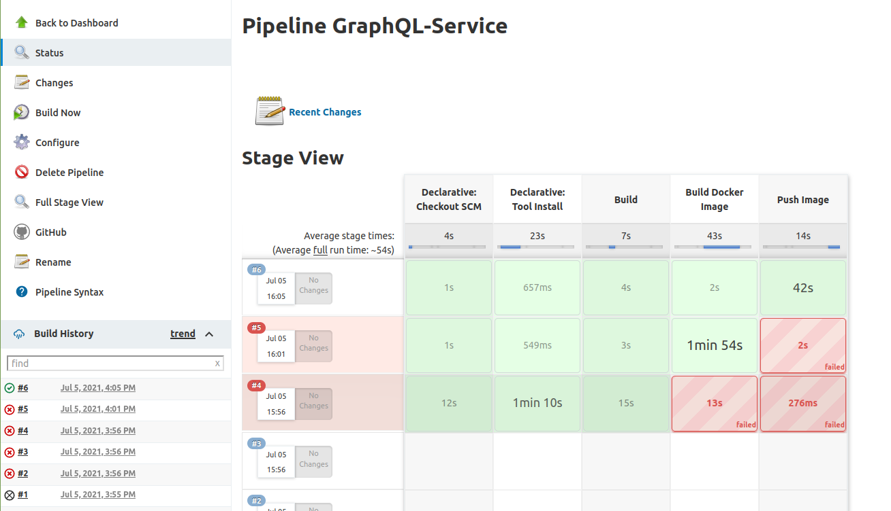

# GraphQL_implementation

This can be used as a boiler plate for any backend micro-service.

### Postmen Collection

    https://www.getpostman.com/collections/537bf6ba3c441fe92903

### Resource

    https://manakuro.medium.com/go-api-with-echo-gorm-and-graphql-1565ad921626

## Jenkins File Result

if have any issue? please refer to my jenkins file guide.

